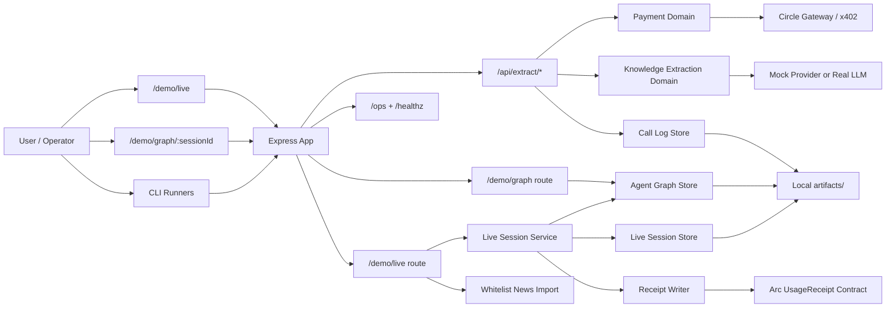
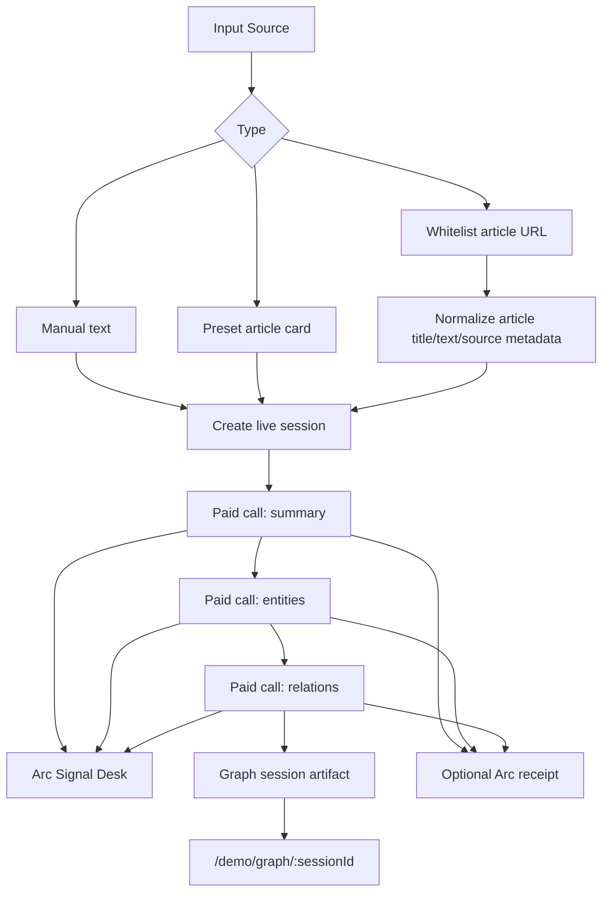
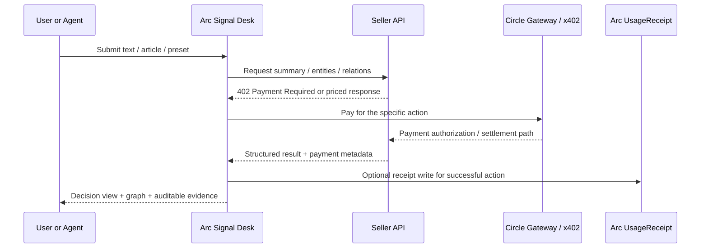

# Arc Signal Desk Architecture

`Arc Signal Desk` packages a paid extraction engine, a live analysis workbench, and an auditable evidence trail into one Arc-native demo. The goal is not just to show that an API can charge users, but to prove that an agent or user can pay for a sequence of micro-actions without gas overhead wiping out the unit economics.

## 1. System Overview

At a high level, the system has four layers:

1. **Experience layer**: browser users access `/demo/live` and `/demo/graph/*`, while operators can run CLI demos for mock runs, gateway buyer flows, and agent sessions.
2. **Application layer**: the Express app exposes `/api/extract/*`, `/demo/live`, `/demo/graph/*`, `/ops`, and `/healthz`.
3. **Domain layer**: payment, extraction, whitelist news import, live session orchestration, and receipt writing are split into focused modules.
4. **Evidence layer**: local artifacts, call logs, session snapshots, and optional Arc `UsageReceipt` transactions provide a traceable record of what happened and what was paid for.

## 2. Architecture Diagram

## 3. Runtime Components

### Entry Points

- `README.md` points new readers to the quick start, runbooks, and judge-facing docs.
- `/demo/live` is the main product surface. It presents the system as a decision desk rather than a raw demo console.
- `/demo/graph/latest` and `/demo/graph/:sessionId` expose the graph and evidence view for a completed session.
- CLI scripts under `scripts/` run repeatable demos for mock calls, gateway buyer runs, and agent-session generation.

### Application Layer

- `src/server.ts` boots the service and loads runtime configuration.
- `src/app.ts` wires the routes, runtime dependencies, and domain services together.
- `src/routes/extract.ts` exposes the paid `summary`, `entities`, and `relations` endpoints.
- `src/routes/live.ts` renders the workbench and creates new live sessions.
- `src/routes/graph.ts` renders the graph browser for completed sessions.
- `src/routes/ops.ts` serves operational metrics.

### Domain Layer

- `src/domain/payment/*` handles the paid-access boundary. In `mock` mode it keeps local development frictionless; in `gateway` mode it lets the seller route use Circle Gateway semantics.
- `src/domain/extraction/*` encapsulates the model-facing logic and keeps the output schema stable across providers.
- `src/domain/news-import/*` imports supported whitelist news URLs and turns them into normalized session inputs.
- `src/domain/receipt/*` optionally maps successful paid actions to Arc `UsageReceipt` transactions for extra on-chain evidence.
- `src/demo/live-session.ts` orchestrates a multi-step run across `summary -> entities -> relations`.

### Evidence Layer

- `artifacts/demo-run/` stores batch demo outputs.
- `artifacts/gateway-run/` stores gateway buyer outputs.
- `artifacts/agent-graph/` stores session payloads used by the graph page.
- `artifacts/live-console/` stores live session snapshots used by the desk UI.

## 4. Live Session Flow

This flow matters because the product is priced per action, not per subscription. Each step can be metered, logged, and optionally tied to a receipt, which makes the economics inspectable at the granularity of real agent work.

## 5. Economic Loop

## 6. Why This Architecture Fits Arc

The architecture is intentionally split between **high-frequency economic actions** and **auditable settlement evidence**:

- The paid extraction API proves that each AI action can have its own price.
- The live workbench proves that a multi-step agent workflow can remain readable and useful to humans.
- The graph view proves that the outputs are composable rather than one-off responses.
- The receipt layer gives the team a concrete answer when judges ask for on-chain proof and transaction traceability.

This is the key design choice: the product does not force every action to become a heavy user flow. It lets a user or an agent pay for exactly the next piece of work, which is the core promise behind sub-cent agentic commerce on Arc.

## 7. Key Files

- `src/app.ts`
- `src/routes/live.ts`
- `src/routes/graph.ts`
- `src/domain/payment/circle-gateway.ts`
- `src/domain/receipt/writer.ts`
- `src/demo/live-session.ts`
- `docs/runbooks/local-dev.md`
- `docs/runbooks/arc-circle-demo.md`
